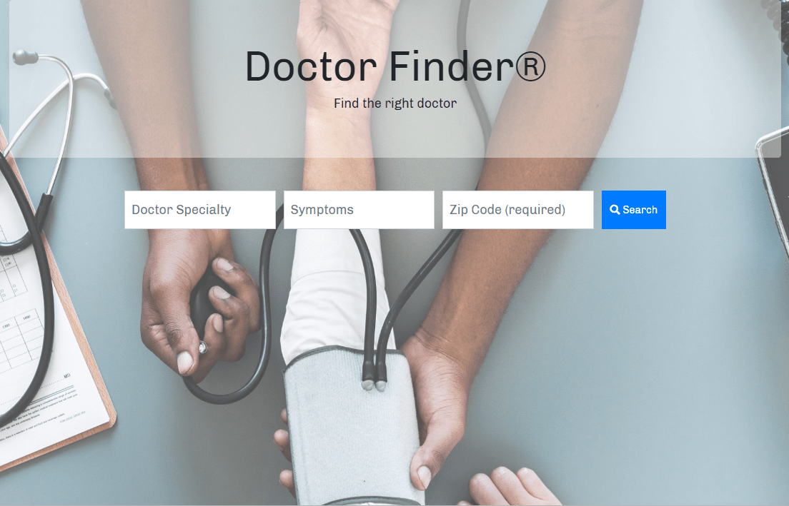

# Doctor-Finder
Doctor Finder helps users in their search for a doctor based on user zip code and doctor specialty or user's syptoms.
The page lists the search results including doctor ratings (if available), and displays the doctor office location on the map.

Link to GitHub pages: https://boki23m.github.io/Doctor-Finder/

Front-end web app using HTML5, CSS3, Javascript, and JQuery; with API calls to BetterDoctor and GoogleMaps.

